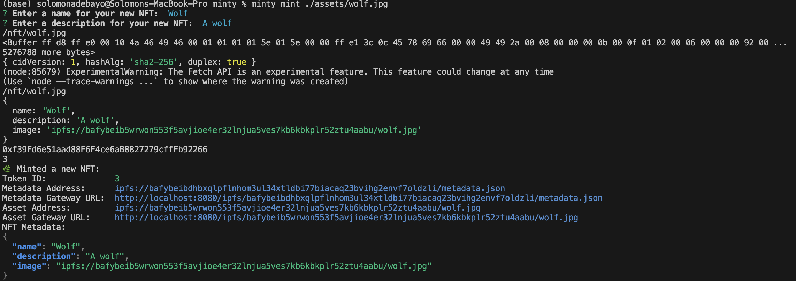
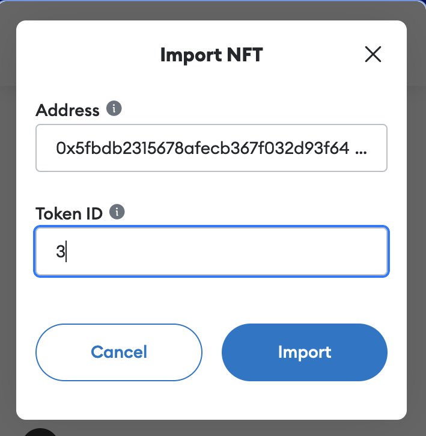
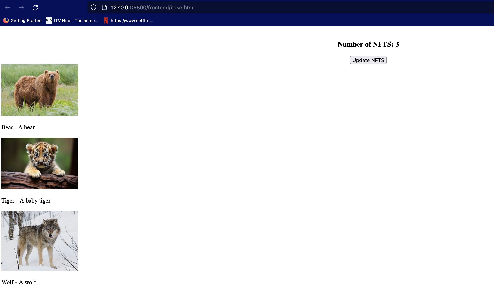

## Simple ERC721 Non-fungible Token (NFT) Service for Animals using Ethereum Solidity

The project demonstrates a siimple Non-fungible Token (NFT) use case that allows tokens to be minted into an address and made available for viewinig via a simple UI. The NFT mintinig service [1] generates an NFT of an animal into an address on a local blockchain (hardhat) node and stores the NFT image of the anima along with its metadata in an Interplanetary File Service (IPFS), a decentralised file system on the web.

An existiing, archiived service [1] was leveraged in creating this project.

The project demos a simple workflow of the following

1. NFT mint (via the `mint` command provided by [1])
   Mintng a Wolf NFT:
   

2. NFT import into metamask (not required for listiing)
   Import Wolf NFT in metamask:
   

3. Listing of the NFTs into a simple web UI
   

[1] https://github.com/yusefnapora/minty
